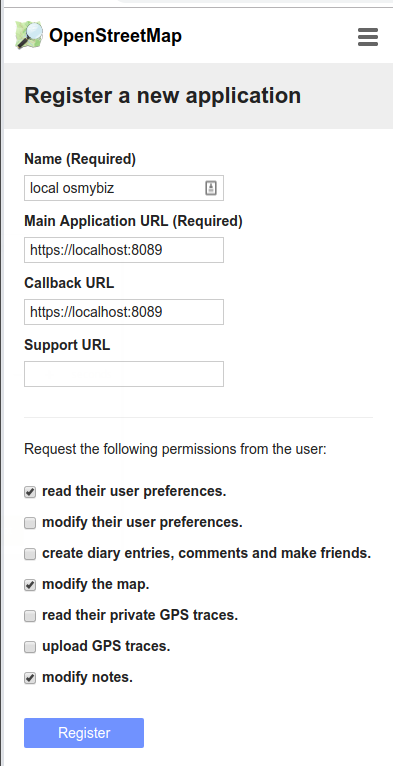

# OpenStreetMap My Business 

Homepage https://osmybiz.osm.ch/ 

## Testing

Test-Instance: https://osmybiz.sifs0003.infs.ch

## local development

Prerequisites: 

* Account at https://master.apis.dev.openstreetmap.org/
* Docker and docker-compose installed and running locally

0. At https://master.apis.dev.openstreetmap.org/ register a new application under oauth,
    ie. `https://master.apis.dev.openstreetmap.org/user/<username>/oauth_clients`.
    Select the correct options, `read prefrences`, `modify map`, and `modify notes`.

    

1. Copy the file .env-openstreetmap-dev.example to .env-openstreetmap-dev and fill out the
fields with the consumer key/secret you just created.

2. Run the whole application locally using `docker-compose up --build`. 

3. Visit https://localhost:8089 and accept the certificate (make an exception).

### running without docker

For hints on running this project without docker/docker-compose 
visit the readme.md files in the corresponding folder (frontend/api).
This approach is not tested nor recommended.

### Adding new language

1. Add the new language file from https://www.transifex.com/openstreetmap/osmybiz/
into ./src/locales/

2. Modify a copy of another language file found under ./src/assets/tags/
using the translation found here https://github.com/openstreetmap/iD/tree/master/dist/locales

3. In main.js, import the json from ./tags/ and add it in the messages list. Keep both in alphabetical order.

4. Lastly, add the language in ./components/shared/LanguageDropDown.vue to SUPPORTEDLANGUAGESOPTIONS.